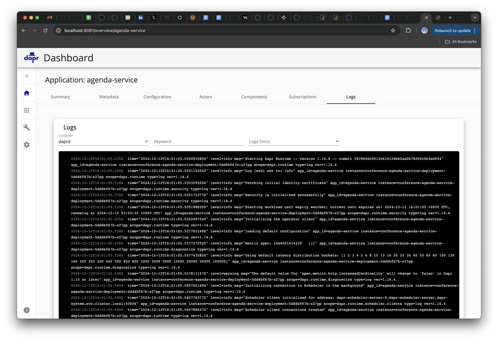

# [Backstage](https://backstage.io)

This is your newly scaffolded Backstage App, Good Luck!

To start the app, run:

```sh
yarn install
yarn dev
```


# Create a KIND Cluster with a Dapr Application

```
kind create cluster
```

```
helm repo add dapr https://dapr.github.io/helm-charts/
helm repo update
helm upgrade --install dapr dapr/dapr \
--version=1.14.4 \
--namespace dapr-system \
--create-namespace \
--wait
```

Install the application: 

```
helm install conference oci://docker.io/salaboy/conference-app --version v2.0.0
```

To access the application: 
```
kubectl port-forward svc/frontend 8080:80
```

Install the Dapr Dashboard:

```
helm install dapr-dashboard dapr/dapr-dashboard
```

To access the Dashboard: 

```
kubectl port-forward svc/dapr-dashboard 8081:8080
```


# APIs to get data from backend

Get all apps

```
curl http://localhost:8081/api/instances/All
```

Get `notification-service` details

```
curl http://localhost:8081/api/instances/All/notifications-service
```

Get Dapr Components

```
curl http://localhost:8081/api/components/All
```

Get Single Dapr Component
```
curl http://localhost:8081/api/components/All/conference-agenda-service-statestore
```

The Dapr Dashboard with the application running looks like this: 




